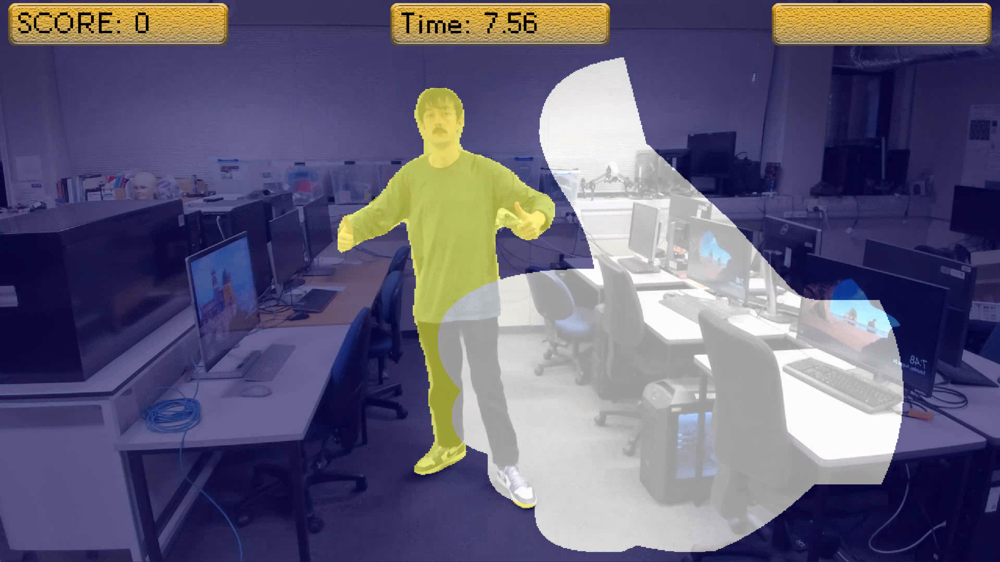

# BrainGame (Hole in the Wall Game) in Python

This repository implements the hole in the wall game based on the game show segment originating in Japan also known as “Brain Wall (脳カベ)”, or “Human Tetris”, where a wall moves towards a contestant to push them into the water. This demo uses Computer Vision/AI models to estimate the pose or outline of people to recreate the Hole in the Wall game. There is a great Wikipedia page on this [here](https://en.wikipedia.org/wiki/Brain_Wall).

We use Python and two deep learning libraries:

- MediaPipe Pose estimation from Google AI for pose estimation. This model has been optimised for low resource devices (e.g., mobile, web, IoT). For more information see the documentation: [documentation](https://ai.google.dev/edge/mediapipe/solutions/guide).
- You Only Look Once version 9 (YOLOv9) for segmentation. This model works best with a GPU. For more information see their repository: [documentation](https://github.com/WongKinYiu/yolov9).



## Table of Contents

- [Installation](#installation)
- [Usage](#usage)
- [License](#license)

## Installation

To get started with this project, follow these steps:

1. **Clone the Repository**:

   ```bash
   git clone https://github.com/mrog173/BrainGame.git
   cd BrainGame
   ```

   Or download the code by downloading the ZIP file (under the "<> Code" button).

   This project uses the yolov9 submodule. To download the submodule using GitHub, run the following commands:

   ```bash
   git submodule init
   git submodule update
   ```

   Or download the code by downloading the ZIP file from the [linked repository](https://github.com/WongKinYiu/yolov9/tree/5b1ea9a8b3f0ffe4fe0e203ec6232d788bb3fcff).
2. **Install the Required Packages**

   ```bash
   pip install -r requirements.txt
   ```

## **Usage**

To run the code from the command line, follow these steps:

```bash
python BrainGame.py --model_type="Segmentation"
```

You can change the model that is used using --model_type="Pose" instead.

Keys that are used:
- Q/ESC: Close.
- F: Show/hide FPS counter.
- L: Go to leaderboard.
- U: Run an untimed version of the game.
- S: Run a timed version of the game for the leaderboard.

## License

This project is licensed under the MIT License - see the LICENSE file for details.
